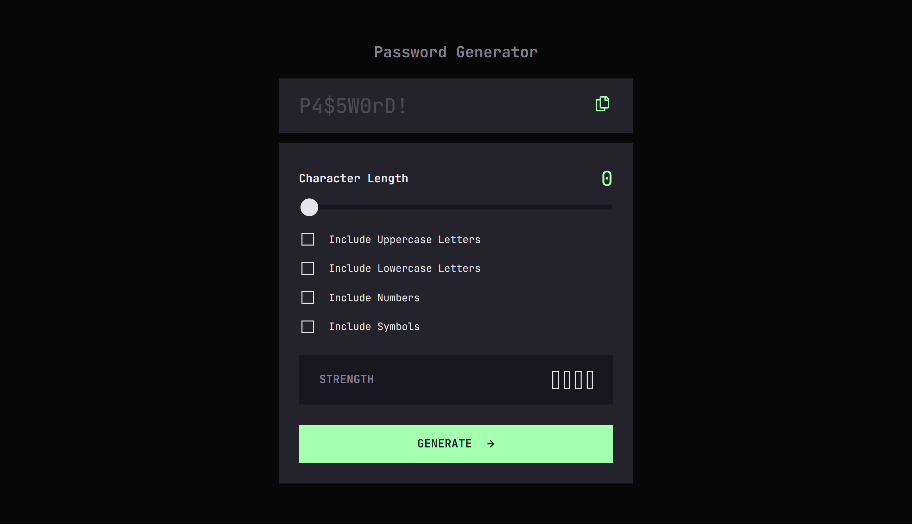

# Frontend Mentor - Password generator app solution

This is a solution to the [Password generator app challenge on Frontend Mentor](https://www.frontendmentor.io/challenges/password-generator-app-Mr8CLycqjh). Frontend Mentor challenges help you improve your coding skills by building realistic projects. 

## Table of contents

- [Overview](#overview)
  - [The challenge](#the-challenge)
  - [Screenshot](#screenshot)
  - [Links](#links)
- [My process](#my-process)
  - [Built with](#built-with)
  - [What I learned](#what-i-learned)
  - [Useful resources](#useful-resources)
- [Author](#author)
- [Acknowledgments](#acknowledgments)

**Note: Delete this note and update the table of contents based on what sections you keep.**

## Overview

### The challenge

Users should be able to:

- Generate a password based on the selected inclusion options
- Copy the generated password to the computer's clipboard
- See a strength rating for their generated password
- View the optimal layout for the interface depending on their device's screen size
- See hover and focus states for all interactive elements on the page

### Screenshot

### Links

- [Solution URL](https://github.com/ralphvirtucio/password-generator)
- [Live Site](https://ralphvirtucio.github.io/password-generator/)

## My process

### Built with

- Semantic HTML5 markup
- CSS custom properties
- Flexbox
- CSS Grid
- Mobile-first workflow

### What I learned

2 things that I learn while doing this challenge are:
1. Entropy approach of checking the password strength
2. Fisher Yates method for shuffling the password.

### Useful resources

- [Clipboard API](https://developer.mozilla.org/en-US/docs/Web/API/Clipboard_API) - This helped me for me implementing the clipboard API. The documentation is straightforward and easy to follow.

- [How to calculate password strength](https://stackoverflow.com/questions/27528738/how-to-calculate-password-strength) - This helped me to have an idea on how to calculate the password strength.

- [Fisher Yates Method(Shuffling password)](https://medium.com/@lakshmanmody/shuffling-an-array-using-the-fisher-yates-method-123ceecb653b) - This article helped me to implement and understand how fisher yates method works.

- [Custom Input Range Slider](https://maame.hashnode.dev/custom-input-range-slider) - A member of Frontend Mentor discord community sent me this article it really helps me on how to set a styles in a native input range slider

## Author

- Frontend Mentor - [@ralphvirtucio](https://www.frontendmentor.io/profile/ralphvirtucio)
- GitHub - [@ralphvirtucio](https://www.github.com/ralphvirtucio)

## Acknowledgments

I acknowledge @gx from the Frontend Mentor discord community for sending me an article on how to create a cusotm input range slider.
